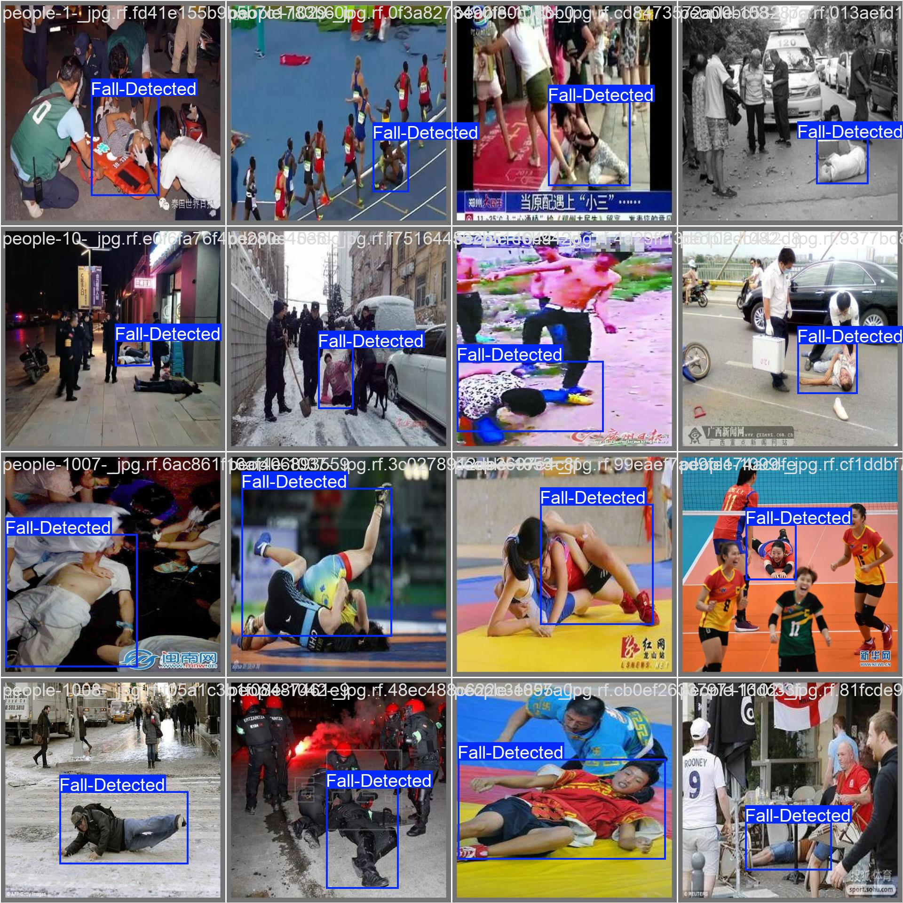

# AI Fall Detection for Elder Care

An AI-based **fall detection and alert system for elderly care** using **YOLO object detection**, **OpenCV**, **NTFY**, and **Twilio WhatsApp**.

The system detects a potential fall through a webcam in real time and automatically sends an alert notification when a fall is detected.


<div align="center">

</div>


---

## 🚀 Project Overview

Falls are one of the major safety concerns for elderly people, particularly when they are alone or require continuous monitoring.

This project provides an automated computer-vision-based solution that:

1. Uses a **YOLO model** trained specifically for fall detection.
2. Opens a **webcam** for real-time monitoring.
3. Detects a person who has fallen.
4. Confirms the detection across consecutive frames to reduce false alarms.
5. Sends an instant notification through **NTFY**.
6. Sends a **WhatsApp alert using Twilio**.

### System Workflow

```text
                 ┌──────────────────┐
                 │   Training Data  │
                 │  Fall Images      │
                 └────────┬─────────┘
                          │
                          ▼
                 ┌──────────────────┐
                 │   YOLO Training  │
                 │  Custom Dataset  │
                 └────────┬─────────┘
                          │
                          ▼
                 ┌──────────────────┐
                 │     best.pt      │
                 │  Trained Model   │
                 └────────┬─────────┘
                          │
                          ▼
                 ┌──────────────────┐
                 │      Webcam      │
                 └────────┬─────────┘
                          │
                          ▼
                 ┌──────────────────┐
                 │  YOLO Inference  │
                 │ Fall Detection   │
                 └────────┬─────────┘
                          │
                    Fall Detected
                          │
             ┌────────────┴────────────┐
             ▼                         ▼
      ┌──────────────┐          ┌──────────────┐
      │     NTFY     │          │    Twilio    │
      │ Notification │          │   WhatsApp   │
      └──────────────┘          └──────────────┘
```

---

## 🧠 AI Model

The fall detection model was trained using **YOLO** on a custom dataset containing images of people in fall-related situations.

### Training Process

```text
Fall Images
     │
     ▼
Dataset Annotation
     │
     ▼
Train / Validation / Test Dataset
     │
     ▼
YOLO Model Training
     │
     ▼
Trained Weights
     │
     ▼
best.pt
```

The trained `best.pt` file is used for real-time inference.

---

## 📂 Project Structure

```text
ai-fall-detection-elder-care/
│
├── README.md
│
├── fall_detection.py
│
├── best.pt
│
├── requirements.txt
│
├── images/
│   └── test_images/
│
└── runs/
    └── detect/
        └── ...
```

> The dataset and training outputs do not necessarily need to be included in the GitHub repository. The trained model weights can be provided separately if required.

---

## 🛠️ Technologies Used

| Technology | Purpose                              |
| ---------- | ------------------------------------ |
| Python     | Main programming language            |
| YOLO       | Fall detection                       |
| OpenCV     | Webcam and image processing          |
| NTFY       | Instant mobile/desktop notifications |
| Twilio     | WhatsApp notifications               |
| PyTorch    | Deep learning framework              |
| Roboflow   | Dataset preparation and annotation   |

---

## ⚙️ Installation

### 1. Clone the repository

```bash
git clone https://github.com/YOUR_USERNAME/ai-fall-detection-elder-care.git
cd ai-fall-detection-elder-care
```

### 2. Create a virtual environment

```bash
python -m venv venv
```

Activate it on Windows:

```bash
venv\Scripts\activate
```

### 3. Install dependencies

```bash
pip install -r requirements.txt
```

---

## 📦 Requirements

Example `requirements.txt`:

```text
ultralytics
opencv-python
numpy
requests
twilio
```

---

## 🎥 Real-Time Fall Detection

After installing the required packages and placing the trained YOLO weights in the project directory, run:

```bash
python fall_detection.py
```

The program will:

* Open the webcam.
* Capture video frames.
* Run YOLO inference.
* Detect falls.
* Draw the detection bounding box.
* Display the confidence score.
* Confirm the fall before triggering an alert.
* Send an NTFY notification.
* Send a WhatsApp notification through Twilio.

---

## 🔔 NTFY Notification

The project uses **NTFY** for instant notifications.

A notification is triggered when a fall is confirmed.

Example:

```text
⚠️ FALL DETECTED!

A possible fall has been detected by the AI monitoring system.
Please check the person immediately.
```

The notification can be received on a smartphone using the NTFY application.

---

## 📱 WhatsApp Alert

The system can also send a WhatsApp message using **Twilio**.

Example:

```text
🚨 FALL ALERT 🚨

A fall has been detected by the AI monitoring system.

Please check the elderly person immediately.
```

Twilio credentials should **never be hard-coded or uploaded to GitHub**.

Use environment variables instead:

```text
TWILIO_ACCOUNT_SID
TWILIO_AUTH_TOKEN
TWILIO_WHATSAPP_FROM
TWILIO_WHATSAPP_TO
```

---

## 🔐 Security

Do **not** upload sensitive credentials to GitHub.

The following should be kept private:

```text
Twilio Account SID
Twilio Auth Token
WhatsApp numbers
API keys
Other authentication credentials
```

A `.env` file can be used for local development.

Example:

```text
TWILIO_ACCOUNT_SID=your_account_sid
TWILIO_AUTH_TOKEN=your_auth_token
TWILIO_WHATSAPP_FROM=your_twilio_whatsapp_number
TWILIO_WHATSAPP_TO=your_whatsapp_number
NTFY_TOPIC=your_ntfy_topic
```

Add `.env` to `.gitignore`:

```text
.env
venv/
__pycache__/
*.pyc
```

---

## 🎯 Key Features

* ✅ AI-based fall detection
* ✅ Custom YOLO-trained model
* ✅ Real-time webcam monitoring
* ✅ Bounding-box visualization
* ✅ Confidence-based detection
* ✅ Consecutive-frame fall confirmation
* ✅ NTFY notifications
* ✅ WhatsApp alerts using Twilio
* ✅ Automated elderly safety monitoring

---

## 🔮 Future Improvements

Possible future improvements include:

* 📷 IP/CCTV camera support
* 🏠 Multi-camera monitoring
* 🧍 Human pose estimation
* ⏱️ Fall-duration estimation
* 📸 Sending the detected frame with the alert
* ☁️ Cloud-based monitoring
* 📊 Web dashboard for caregivers
* 🗺️ Location-aware emergency alerts
* 🚑 Integration with emergency services
* 👥 Multiple-person tracking
* 🔊 Local audio alarm

---

## 👨‍💻 Author

**Pulkit Garg**

Robotics & AI Engineer

This project demonstrates the application of **computer vision and AI for elderly safety and care**.
